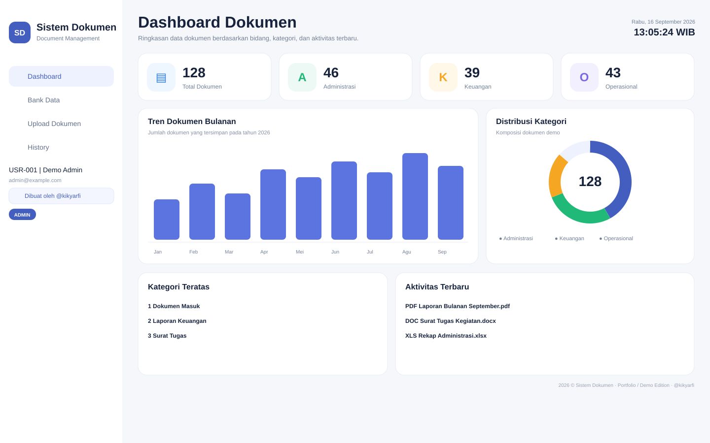
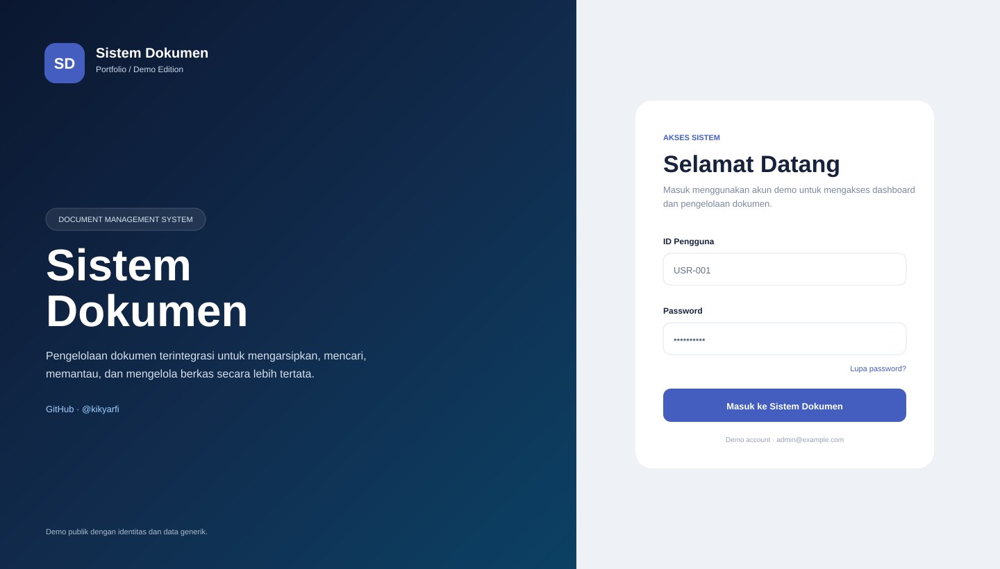
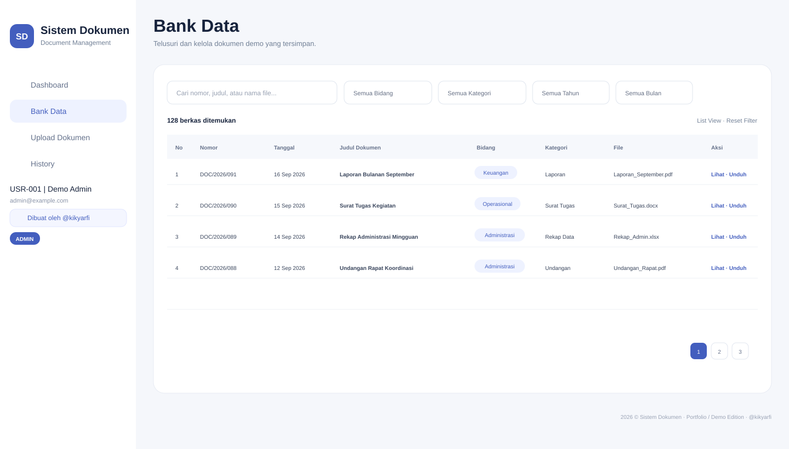
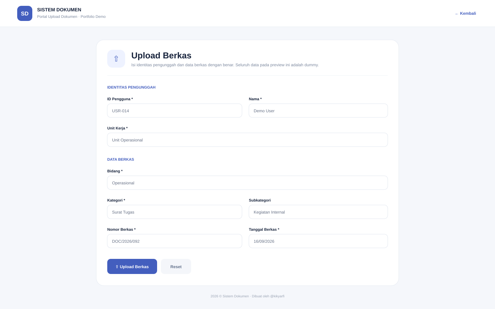

<div align="center">

# 📁 Sistem Dokumen

### Web-based Document Management System

Sistem manajemen dokumen berbasis **Google Apps Script**, **Google Sheets**, dan **Google Drive** untuk mengelola arsip, upload, pencarian, dashboard, role pengguna, audit history, dan preview PDF dalam satu aplikasi web.

[](https://script.google.com/)
[](https://www.google.com/sheets/about/)
[](https://www.google.com/drive/)


**Portfolio / Demo Edition — public-safe version**

</div>

---

<p align="center">
  
</p>

> [!IMPORTANT]
> Repository ini adalah **versi portfolio/demo yang telah disanitasi**. Seluruh nama organisasi, logo, struktur internal, data pegawai, dokumen asli, kredensial, ID produksi, dan konfigurasi sensitif telah dihapus atau diganti dengan data generik.

## Table of Contents

- [Overview](#overview)
- [Why This Project](#why-this-project)
- [Features](#features)
- [Role & Access](#role--access)
- [Application Preview](#application-preview)
- [How It Works](#how-it-works)
- [Tech Stack](#tech-stack)
- [Project Structure](#project-structure)
- [Demo Setup Guide](#demo-setup-guide)
- [Demo Data](#demo-data)
- [Security](#security)
- [Testing Checklist](#testing-checklist)
- [Roadmap](#roadmap)
- [Portfolio Notice](#portfolio-notice)
- [Author](#author)

---

## Overview

**Sistem Dokumen** adalah aplikasi web untuk membantu pengelolaan dokumen secara terstruktur. Aplikasi menyediakan alur mulai dari autentikasi pengguna, upload berkas, pengelompokan dokumen berdasarkan bidang/kategori/subkategori, pencarian dan filter, preview PDF, hingga pencatatan aktivitas.

Versi pada repository ini dibuat khusus untuk kebutuhan **portfolio dan pembelajaran**. Source code mempertahankan fitur dan arsitektur utama aplikasi, tetapi menggunakan identitas, akun, master data, dan konfigurasi demo.

### Tujuan utama

- menyimpan dokumen secara lebih terstruktur;
- mempermudah pencarian dan penelusuran berkas;
- membedakan hak akses `ADMIN` dan `USER`;
- menyediakan upload internal dan public upload;
- mencatat aktivitas penting dalam history;
- menampilkan statistik melalui dashboard;
- menyediakan preview PDF langsung di aplikasi;
- menjaga konfigurasi rahasia di luar source code.

---

## Why This Project

Pengelolaan dokumen melalui folder biasa dapat menjadi sulit ketika jumlah berkas mulai bertambah. Pencarian, klasifikasi, histori aktivitas, dan pengaturan akses sering kali tersebar di beberapa tempat.

Sistem Dokumen menyatukan alur tersebut menjadi satu aplikasi ringan dengan ekosistem Google Workspace:

```text
User / Public Uploader
        │
        ▼
 Google Apps Script Web App
        │
        ├───────────────┐
        ▼               ▼
 Google Sheets       Google Drive
 Metadata / User     File Storage
        │               │
        └───────┬───────┘
                ▼
      Dashboard & Bank Data
```

Pendekatan ini cocok untuk prototype, portfolio, pembelajaran, atau workflow internal berskala ringan yang tidak membutuhkan server terpisah.

---

## Features

| Feature | Description |
|---|---|
| 🔐 Authentication | Login menggunakan **ID Pengguna** dan password |
| 👥 Role Based Access | Hak akses berbeda untuk `ADMIN` dan `USER` |
| ⏱️ Session Management | Sliding session dengan idle timeout |
| 🛡️ Login Protection | Rate limiting percobaan login |
| 🔑 Password Recovery | OTP email → verifikasi → reset link |
| 📊 Dashboard | Statistik, tren, distribusi, aktivitas terbaru, dan kapasitas dokumen |
| 🗂️ Bank Data | Search, filter, pagination, list/gallery view |
| 📤 Internal Upload | Upload dokumen oleh admin |
| 🌐 Public Upload | Upload tanpa login dengan identitas uploader |
| 🧩 Classification | Bidang → Kategori → Subkategori |
| 📄 PDF Preview | Preview PDF dengan PDF.js |
| 📥 Download | Download file menggunakan nama file asli |
| 🧾 History | Audit/activity history untuk aktivitas penting |
| 🌙 Theme | Light dan Dark Mode |
| 📦 File Validation | PDF, Word, Excel, PowerPoint; maksimal 10 MB |
| 🔒 Write Protection | `LockService` untuk operasi tulis |
| 🔐 Secret Management | Secret disimpan melalui Apps Script Script Properties |

---

## Role & Access

### `ADMIN`

Admin memiliki akses penuh ke fitur pengelolaan sistem:

- Dashboard
- Bank Data
- Preview & Download
- Upload dokumen internal
- Edit / hapus dokumen
- History

### `USER`

User digunakan untuk akses dokumen yang lebih terbatas:

- Dashboard
- Bank Data
- Preview & Download

Fitur administratif seperti upload internal, edit, hapus, dan history tidak diberikan kepada role `USER`.

### Public User

Pengguna publik tidak memerlukan akun login untuk membuka alur **Public Upload**. Identitas yang dimasukkan pada versi demo berupa data generik seperti `ID Pengguna`, nama, dan unit kerja.

---

## Application Preview

Preview berikut dibuat dari **UI versi GitHub / Portfolio Edition** menggunakan dummy data sehingga tidak menampilkan data organisasi atau dokumen nyata.

### Dashboard

<p align="center">
  
</p>

Dashboard menampilkan ringkasan jumlah dokumen, statistik per bidang, tren bulanan, distribusi kategori, ranking, dan aktivitas terbaru.

### Login

<p align="center">
  
</p>

Halaman autentikasi menggunakan identitas aplikasi generik dan menampilkan akun demo tanpa membawa branding organisasi asli.

### Bank Data

<p align="center">
  
</p>

Bank Data digunakan untuk mencari, memfilter, melihat metadata, preview, dan mengunduh dokumen.

### Public Upload

<p align="center">
  
</p>

Public Upload memungkinkan dokumen dikirim tanpa login dengan metadata dan identitas uploader yang tetap tercatat.

---

## How It Works

### Authenticated workflow

```text
Login
  │
  ▼
Validate ID + Password
  │
  ▼
Create Session Token
  │
  ├── ADMIN ──► Dashboard / Bank Data / Upload / History
  │
  └── USER  ──► Dashboard / Bank Data
```

### Public upload workflow

```text
Public Upload
     │
     ▼
Uploader Identity
     │
     ▼
Bidang → Kategori → Subkategori
     │
     ▼
File Validation
     │
     ├── Metadata → Google Sheets
     └── File     → Google Drive
```

### Forgot password workflow

```text
ID Pengguna
     │
     ▼
Validate User
     │
     ▼
Send 6-digit OTP
     │
     ▼
Verify OTP
     │
     ▼
Send One-time Reset Link
     │
     ▼
Set New Password
```

---

## Tech Stack

| Layer | Technology |
|---|---|
| Backend | Google Apps Script |
| Frontend | HTML, CSS, JavaScript |
| Database / Metadata | Google Sheets |
| File Storage | Google Drive |
| UI | Custom UI + Bootstrap Icons / Mazer-inspired layout |
| PDF Renderer | PDF.js `4.10.38` legacy build |
| Security Testing | OWASP ZAP Passive Scan |
| Secret Storage | Apps Script Script Properties |

---

## Project Structure

```text
Sistem-Dokumen/
│
├── src/
│   ├── Code.gs
│   ├── Bidang.gs
│   ├── index.html
│   ├── Styles.html
│   ├── Landing.html
│   ├── PublicUpload.html
│   ├── Login.html
│   ├── AppShellStart.html
│   ├── Dashboard.html
│   ├── BankData.html
│   ├── AdminUpload.html
│   ├── History.html
│   ├── AppShellEnd.html
│   ├── Modals.html
│   └── Scripts.html
│
├── demo-data/
│   ├── USERS.example.csv
│   ├── BIDANG.example.csv
│   ├── KATEGORI.example.csv
│   └── SUBKATEGORI.example.csv
│
├── docs/
│   └── images/
│       ├── dashboard-preview.svg
│       ├── login-preview.svg
│       ├── bank-data-preview.svg
│       └── public-upload-preview.svg
│
├── SECURITY.md
├── PORTFOLIO_NOTICE.md
├── SANITIZATION_REPORT.txt
├── GITHUB_PUSH_CHECKLIST.md
├── appsscript.json.example
├── .gitignore
└── README.md
```

---

# Demo Setup Guide

## Prerequisites

Sebelum memulai, siapkan:

- akun Google;
- akses ke Google Apps Script;
- Google Drive;
- izin membuat Google Spreadsheet;
- repository ini sebagai referensi source.

Tidak diperlukan server VPS, Node.js, PHP, atau database eksternal untuk menjalankan demo dasar.

---

## 1. Create a Google Apps Script Project

Buka **Google Apps Script** dan buat project baru.

Kemudian buat file dengan nama yang sama seperti folder `src/`.

> `Code.gs` dan `Bidang.gs` dibuat sebagai file script `.gs`, sedangkan file lainnya dibuat sebagai file HTML.

Contoh:

```text
Code.gs
Bidang.gs
index.html
Styles.html
Landing.html
PublicUpload.html
Login.html
AppShellStart.html
Dashboard.html
BankData.html
AdminUpload.html
History.html
AppShellEnd.html
Modals.html
Scripts.html
```

Salin source dari repository ke masing-masing file Apps Script.

---

## 2. Run Demo Setup

Dari Apps Script editor, pilih function:

```javascript
setupDemoDatabase()
```

kemudian klik **Run**.

Saat pertama kali dijalankan, Google akan meminta authorization karena script membutuhkan akses ke Sheets, Drive, dan layanan Apps Script terkait.

Function setup akan:

- membuat Google Spreadsheet demo;
- membuat sheet `USERS`;
- membuat sheet `BERKAS`;
- membuat sheet `HISTORY`;
- membuat master data demo;
- membuat folder Google Drive demo;
- menyimpan `SPREADSHEET_ID`;
- menyimpan `ROOT_FOLDER_ID`;
- membuat `APP_SECRET` secara otomatis.

Nilai tersebut disimpan melalui **Script Properties**, bukan hard-coded di source code.

> [!CAUTION]
> Jangan commit nilai aktual `SPREADSHEET_ID`, `ROOT_FOLDER_ID`, `APP_SECRET`, token, atau URL deployment ke repository publik.

---

## 3. Prepare a Demo User

Contoh struktur user tersedia pada:

```text
demo-data/USERS.example.csv
```

Tambahkan akun dummy ke sheet `USERS`, kemudian atur password menggunakan function:

```javascript
setDemoUserPassword('USR-001', 'password-demo-yang-aman')
```

Password minimal **8 karakter**.

Function tersebut menyimpan hash password, bukan plain text password.

> Gunakan akun dummy. Jangan gunakan ID, email, atau password akun organisasi/produksi.

---

## 4. Load Demo Master Data

Master data contoh tersedia di:

```text
demo-data/BIDANG.example.csv
demo-data/KATEGORI.example.csv
demo-data/SUBKATEGORI.example.csv
```

Contoh bidang demo:

```text
Administrasi
Keuangan
Operasional
```

Master data ini sengaja dibuat generik untuk kebutuhan public portfolio.

---

## 5. Deploy as Web App

Di Apps Script:

```text
Deploy
└── New deployment
    └── Web app
```

Pilih konfigurasi akses sesuai kebutuhan akun Google yang digunakan.

Setelah deployment selesai, Google Apps Script akan menghasilkan URL Web App.

> Jangan menaruh URL deployment yang terhubung ke data pribadi atau environment produksi di repository publik.

---

## 6. Test the Demo

Setelah deployment, uji minimal:

```text
[ ] Login ADMIN
[ ] Login USER
[ ] Role restriction
[ ] Session persistence
[ ] Session timeout
[ ] Forgot password
[ ] OTP verification
[ ] Reset password
[ ] Dashboard
[ ] Bank Data search/filter
[ ] Internal upload
[ ] Public upload
[ ] PDF preview
[ ] Download
[ ] History
[ ] Logout
```

---

## Demo Data

Semua contoh pada repository menggunakan data dummy.

Contoh:

```text
ID Pengguna : USR-001
Nama        : Demo Admin
Email       : admin@example.com
Role        : ADMIN
Status      : ACTIVE
```

Contoh dokumen yang ditampilkan di preview juga bersifat fiktif, seperti:

```text
Laporan Bulanan September.pdf
Surat Tugas Kegiatan.docx
Rekap Administrasi.xlsx
```

---

## Security

Beberapa mekanisme yang digunakan dalam project:

- password disimpan dalam bentuk hash;
- secret disimpan melalui Script Properties;
- login rate limiting;
- sliding session timeout;
- role validation pada backend;
- file extension allowlist;
- file size limit 10 MB;
- duplicate filename protection;
- `LockService` untuk operasi tulis;
- one-time OTP/reset flow;
- PDF preview menggunakan PDF.js yang telah diperbarui;
- `isEvalSupported: false` pada proses render PDF.

### OWASP ZAP

Project telah diuji menggunakan **OWASP ZAP Passive Scan**.

Pada pengembangan awal, PDF.js versi lama menghasilkan temuan vulnerable JavaScript library. Pada versi yang dipublikasikan, library telah diperbarui ke PDF.js `4.10.38` legacy build dan hardening preview diterapkan.

Sebagian alert lain pada deployment Google Apps Script dapat berasal dari layer platform Google, misalnya Google CSP, `script.googleusercontent.com`, atau Google Fonts.

Detail tambahan tersedia di:

- [`SECURITY.md`](SECURITY.md)
- [`SANITIZATION_REPORT.txt`](SANITIZATION_REPORT.txt)

---

## Testing Checklist

| Area | Test |
|---|---|
| Authentication | Valid/invalid login |
| Authorization | ADMIN vs USER access |
| Session | Refresh, timeout, logout |
| Password Recovery | OTP, expiry, invalid OTP, reset link |
| Upload | Valid file, invalid type, file >10 MB |
| Bank Data | Search, filter, list, gallery |
| Dashboard | Statistics and navigation |
| PDF | Preview and zoom |
| History | Activity recording |
| Security | OWASP ZAP passive scan |

---

## Roadmap

Beberapa pengembangan yang dapat ditambahkan pada versi berikutnya:

- [ ] document versioning;
- [ ] approval / review workflow;
- [ ] email notification untuk dokumen baru;
- [ ] export report ke Excel/PDF;
- [ ] multi-level permission;
- [ ] dashboard audit yang lebih detail;
- [ ] advanced search;
- [ ] automated testing;
- [ ] CI/CD menggunakan `clasp` + GitHub Actions;
- [ ] optional Google Workspace SSO.

---

## Portfolio Notice

Repository ini **bukan mirror, backup, atau source production dari organisasi tertentu**.

Tidak ada data berikut yang disertakan:

- nama/logo organisasi asli;
- struktur unit internal asli;
- data pegawai asli;
- ID/NIP asli;
- email internal;
- password asli;
- dokumen asli;
- nomor dokumen asli;
- tanda tangan;
- API key / secret produksi;
- Spreadsheet ID produksi;
- Folder ID produksi;
- deployment URL produksi.

Lihat [`PORTFOLIO_NOTICE.md`](PORTFOLIO_NOTICE.md) untuk catatan repository publik.

---

## Author

<div align="center">

### Kiky

**Developer — Sistem Dokumen**

[](https://github.com/kikyarfi)

Built as a portfolio project to demonstrate document-management workflows using Google Apps Script, Google Sheets, and Google Drive.

**© 2026 Kiky**

</div>
